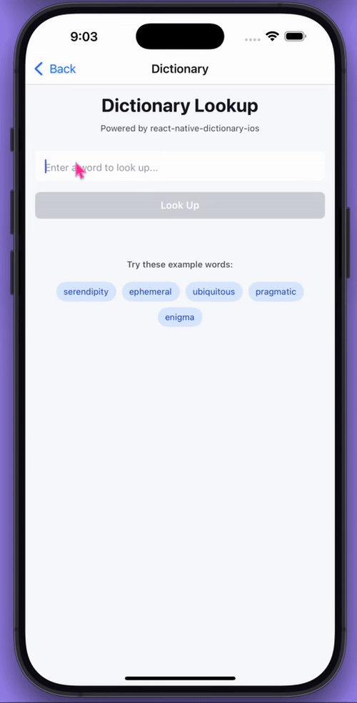

# react-native-dictionary-ios

Access the native iOS dictionary in React Native.

**Super lightweight** - Minimal footprint with just a thin wrapper around iOS native APIs.

**iOS only** - No Android implementation included, won't affect Android builds.

**Bare React Native only** - Does not work with Expo managed workflow. You need access to native iOS code.

## Demo



## Important Notes

This library provides access to the **native iOS dictionary UI**:

- **No custom styling** - The dictionary appears as a native iOS modal that cannot be styled or customized
- **Theme follows device** - The dictionary theme (light/dark) automatically matches the device's system theme and cannot be changed programmatically
- **No data returned** - The dictionary shows definitions to the user but does not return the actual definition text to your app
- **Read-only interface** - This is purely for displaying definitions to users, not for extracting dictionary data

## Installation

```bash
# npm
npm install react-native-dictionary-ios

# yarn
yarn add react-native-dictionary-ios

# Install iOS dependencies
cd ios && pod install
```

## Usage

```typescript
// Default import
import Dictionary from 'react-native-dictionary-ios';

await Dictionary.showDefinition('example');
await Dictionary.checkIfTermExists('hello');
await Dictionary.isDictionaryAvailable();

// Named imports
import { showDefinition, checkIfTermExists, isDictionaryAvailable } from 'react-native-dictionary-ios';

await showDefinition('example');
const result = await checkIfTermExists('hello');
const available = await isDictionaryAvailable();

// Import types
import type { DictionaryResult, TermExistsResult } from 'react-native-dictionary-ios';
```

## API

| Method                            | Returns                                     | Description                               |
| --------------------------------- | ------------------------------------------- | ----------------------------------------- |
| `showDefinition(term: string)`    | `Promise<{success: boolean, term: string}>` | Shows the iOS dictionary view for a word  |
| `checkIfTermExists(term: string)` | `Promise<{exists: boolean, term: string}>`  | Checks if a word has a definition         |
| `isDictionaryAvailable()`         | `Promise<boolean>`                          | Checks if dictionary service is available |

## Requirements

- iOS 11.0+
- React Native 0.60+
- Dictionary must be downloaded on device (Settings > General > Dictionary)

## License

MIT
